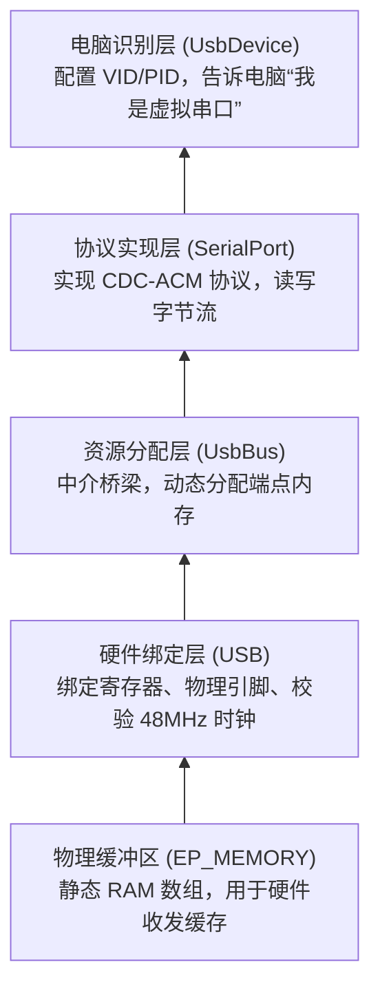

# STM32 USB CDC 虚拟串口配置与原理笔记

在进行 STM32 嵌入式开发中，配置 USB 虚拟串口（CDC ACM）是一个非常高效的调试手段，其性能和连线便利性远优于传统串口（UART/USART）。以下是针对 Nucleo-F439ZI 开发板在 Rust 中配置 USB 虚拟串口的完整笔记。

---

## 一、 调试与初始化踩坑记录

在点亮 LED 和初始化时钟时，遇到了两个非常经典的硬件及配置冲突 Bug：

### 1. 时钟起振挂起问题（HSE Bypass）
*   **现象**：程序卡死在 `dp.RCC.freeze(rcc)`，后面的主循环完全不执行。
*   **原因**：开发板（如 Nucleo-F439ZI）上默认**没有焊接无源晶振**。HSE（外部高速时钟）实际上是由板载的 ST-LINK 调试器生成一个有源 8MHz 方波，注入到芯片的 `OSC_IN` 引脚，而 `OSC_OUT` 悬空。如果以普通的“无源晶振”模式初始化，芯片会因等不到晶振稳定而永久挂起。
*   **解决办法**：在时钟树配置中显式启用旁路模式（Bypass）：
    ```rust
    let rcc = rcc::Config::hse(8.MHz())
        .bypass_hse_oscillator() // 启用旁路模式，接受有源方波输入
        .sysclk(168.MHz())
        // ...
    ```

### 2. LED 无法点亮问题（Open-Drain vs. Push-Pull）
*   **现象**：LED 引脚调用 `.set_high()`，但物理 LED 保持熄灭。
*   **原因**：开发板的用户 LED 是**高电平点亮（Active High）**。如果将引脚配置为开漏输出（`into_open_drain_output()`），引脚只能输出低电平或呈高阻态（悬空），无法主动输出 3.3V 电流驱动 LED。
*   **解决办法**：将引脚配置为推挽输出：
    ```rust
    let mut led_green = gpiob.pb0.into_push_pull_output(); // 使用推挽输出
    ```

---

## 二、 Rust 嵌入式 USB 架构分层

在 Rust 的嵌入式生态中，USB 驱动采用了高度解耦的分层设计：



1.  **`EP_MEMORY`（端点内存）**：必须是拥有静态生命周期（`'static`）的全局缓冲区（如 `[u32; 1024]`），供底层的 USB 硬件控制器直接存取数据包。
2.  **`USB::new(...)`**：绑定硬件寄存器（`OTG_FS_GLOBAL` 等）、物理引脚（`PA11`/`PA12`）并传入时钟配置（USB 必须有通过 `.require_pll48clk()` 生成的 **48MHz** 精确时钟）。
3.  **`UsbBus`**：总线管理器，从 `EP_MEMORY` 中切割并给上层协议分配专属的内存地址。
4.  **`SerialPort`**：Rust 库（`usbd-serial`）实现的 CDC-ACM 串口类。它在初始化时会自动向 `UsbBus` 申请 3 个端点。
5.  **`UsbDevice`**：USB 核心设备。配置 VID/PID 等描述符，让操作系统能够加载正确的串口驱动。

---

## 三、 双缓冲区与数据流向原理

USB 读写过程中，存在两个分工不同的缓冲区：

1.  **全局硬件缓冲区 `EP_MEMORY`**（“小区快递柜”）：
    *   直接对接物理 USB 线和芯片硬件。
    *   硬件收到电气信号后，会自动把整包数据写入该区域，并拉高标志位，不占用 CPU 资源。
2.  **`main` 中的局部工作区 `buf`**（“您的办公桌”）：
    *   属于您在代码中自己定义的私有临时空间（如 `[u8; 64]`）。
    *   当调用 `serial.read(&mut buf)` 时，CPU 会把数据从 `EP_MEMORY` 搬运到 `buf` 中供业务逻辑处理。

### 读写流程：


*   **USB 是块传输，不是单字节传输**：USB 全速 Bulk 传输以最大 **64 字节** 的数据包（Packet）为单位。`serial.read(&mut buf)` 会一次性拷贝整包数据并返回接收到的字节数（如 `Ok(15)`），效率极高。

---

## 四、 端点内存的动态分配

*   **什么是端点（Endpoint）**：逻辑上的独立通道（类似端口号）。每个 USB 设备必须有端点 0（控制通道），虚拟串口还需要端点 1 OUT（接收）、端点 2 IN（发送）、端点 3 IN（状态中断）。
*   **动态申请机制**：
    1.  我们在代码里通常不需要手动指定端点大小，因为 `usbd-serial` 库在它的构造函数里已经写好了向 `usb_bus` 的申请（如：Bulk 接收 64 字节、Bulk 发送 64 字节）。
    2.  `UsbBus` 作为分配器，在运行时根据这些请求，动态计算偏移量，在 `EP_MEMORY` 中为这些端点划分专属空间。
    3.  如果端点总容量超出了 `EP_MEMORY`，程序会在启动时 `panic!`。

---

## 五、 编译与免 sudo 测试指南

### 1. 依赖配置（`Cargo.toml`）
必须开启 `stm32f4xx-hal` 的 **`usb_fs`**（注意是下划线，不是连字符）特征，并加入协议栈依赖：
```toml
[dependencies]
usb-device = "0.3.2"
usbd-serial = "0.2.2"
static-cell = "2.1.0" # （可选，用于实现安全的静态内存分配）

[dependencies.stm32f4xx-hal]
version = "0.23.0"
features = ["stm32f439", "defmt", "usb_fs"]
```

### 2. 避免 Rust 2024 `static_mut_refs` 报错
直接获取 `static mut` 的可变引用已被 Rust 2024 禁用。您应使用 `core::ptr::addr_of_mut!` 获取原始指针再解引用：
```rust
let usb_bus = UsbBus::new(usb, unsafe { &mut *core::ptr::addr_of_mut!(EP_MEMORY) });
```
*(或者使用 `static-cell` 库的 `ConstStaticCell::take` 更加安全地获取)*

### 3. Linux 免 sudo 测试步骤 (Manjaro / Arch)
在 Linux 下，默认只有 `root` 用户有权访问串口 `/dev/ttyACM*`。
1.  **物理连接**：连接开发板顶部的 `ST-LINK` 接口（烧录/供电）和底部的 `USB USER` 接口（进行 USB 测试）。
2.  **添加用户组**（Manjaro 串口设备属于 `uucp` 组）：
    ```bash
    sudo usermod -aG uucp $USER
    ```
3.  **刷新用户组**：
    *   临时刷新（当前终端）：`newgrp uucp`
    *   全局刷新：注销系统重新登录，或重启电脑。
4.  **进行收发测试**（使用 `picocom` 调试串口，按 `Ctrl+A` 然后按 `Ctrl+X` 退出）：
    ```bash
    picocom /dev/ttyACM2  # 具体设备号（ACM1/ACM2）请用 ls -l /dev/ttyACM* 确认
    ```
